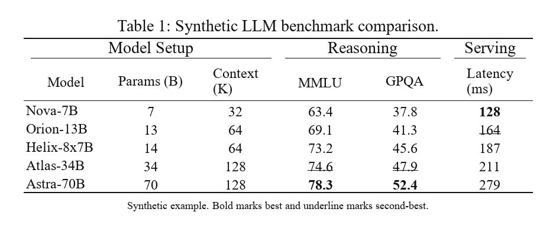
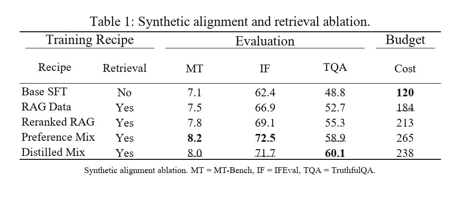
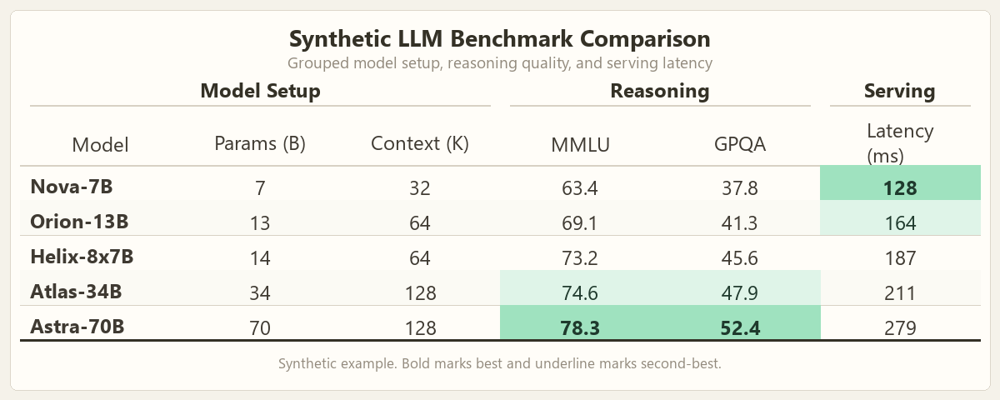
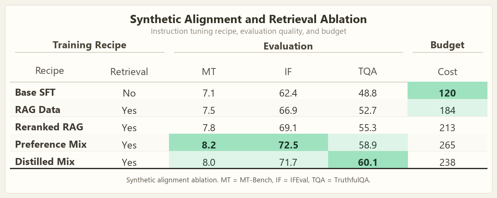
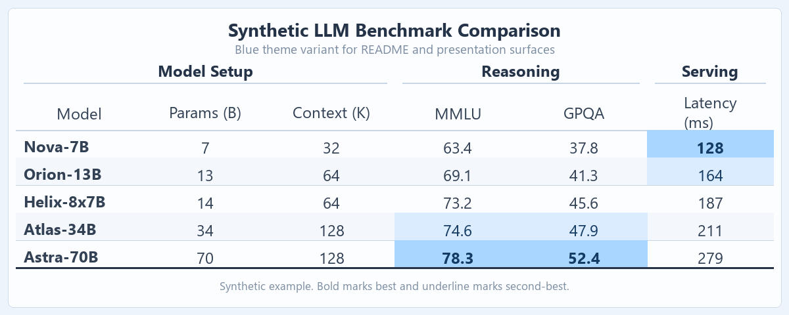
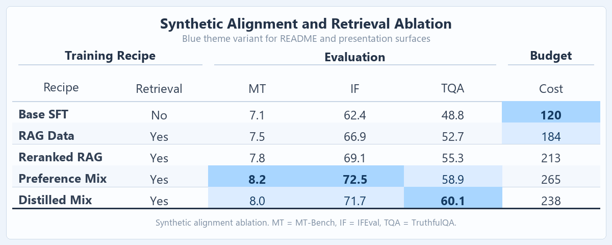
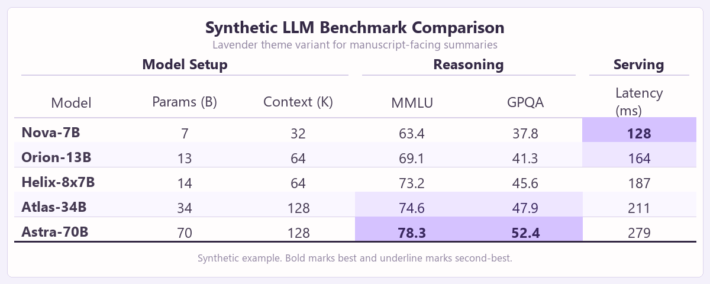
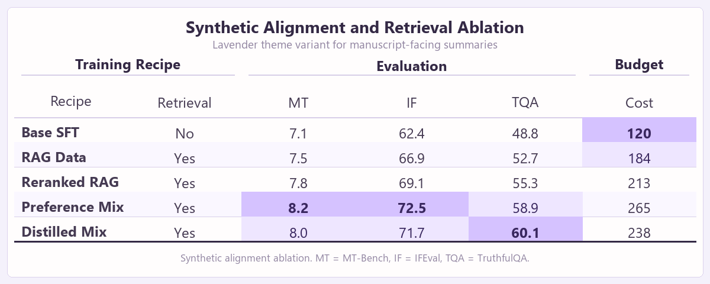

# Optimize LaTeX Tables Skill

`optimize-latex-tables` 是一个面向 Codex 的 LaTeX 表格优化 skill，用于从 CSV、TSV、Excel、JSON 或已有 LaTeX 表格生成可直接用于论文的高质量表格。它的重点是适配会议/期刊模板、保持原始数据不变、生成可复现的验证报告，并在可用时编译预览。

## 功能概览

- 将结构化数据或已有 `tabular` 表格转换为清晰的 LaTeX 表格。
- 根据目标论文或模板 `.tex` 自动推断版式约束。
- 通过 `table_data.json` 和数据指纹保护原始数据。
- 支持保守的 best / second-best 高亮，并允许显式指定指标方向。
- 支持分组表头、按数据集或任务分组比较、行分组和表注。
- 生成 validation、audit、manifest、preview 等可复现报告。
- 在可用时使用 Tectonic 编译预览，并记录 PDF/PNG 产物。

## 示例输出

下面的图片都由 `optimize-latex-tables` 基于合成的大模型研究数据生成。不同风格只改变展示方式，不改变表格数值。

### Classic LaTeX Style

黑白论文风格，包含分组表头、booktabs 式横线、最佳值加粗和次优值下划线。





### Sage Theme

暖色纸面背景和克制的浅绿色高亮，适合 README 和项目主页示例。





### Blue Theme

浅蓝色风格，适合技术报告、模型系统对比和幻灯片摘要。





### Lavender Theme

柔和浅紫色风格，适合消融实验摘要和论文概览图。





## 仓库结构

```text
.
|-- SKILL.md
|-- agents/openai.yaml
|-- assets/
|-- examples/readme-demo/
|-- references/
|   |-- highlight-policy.md
|   |-- input-contracts.md
|   |-- quality-gates.md
|   |-- table-design-rules.md
|   |-- table-spec.md
|   |-- template-detection.md
|   `-- workflow-recipes.md
`-- scripts/
    |-- table_pipeline.py
    `-- smoke_test.py
```

## 快速开始

当你同时有数据文件和目标论文模板时，推荐使用一条命令完成完整流程：

```bash
python scripts/table_pipeline.py build \
  --paper paper.tex \
  --input results.csv \
  --caption "Main results." \
  --label "tab:main-results" \
  --outdir table-build
```

该命令会生成：

- `template_profile.json`
- `table_data.json`
- `table.tex`
- `generation_manifest.json`
- `validation.json`
- `audit.json`
- `preview.json`，如果预览成功
- `build_summary.json`

## 复杂表格

如果需要分组表头、组内比较、行分组或表注，可以使用 `table_spec.json`：

```json
{
  "metric_directions": {
    "Accuracy": "higher",
    "Loss": "lower"
  },
  "compare_by": ["Dataset"],
  "row_group_by": ["Dataset"],
  "column_groups": [
    {"label": "Setup", "columns": ["Dataset", "Method"]},
    {"label": "Metrics", "columns": ["Accuracy", "Loss"]}
  ],
  "notes": ["Bold indicates best within each dataset."]
}
```

然后运行：

```bash
python scripts/table_pipeline.py build \
  --paper paper.tex \
  --input grouped-results.csv \
  --caption "Grouped results." \
  --label "tab:grouped-results" \
  --outdir grouped-build \
  --config table_spec.json
```

## 分步命令

调试时可以逐步执行：

```bash
python scripts/table_pipeline.py analyze-template --tex paper.tex --out template_profile.json
python scripts/table_pipeline.py ingest --input results.csv --out table_data.json
python scripts/table_pipeline.py generate --data table_data.json --template template_profile.json --caption "Results." --label "tab:results" --out table.tex
python scripts/table_pipeline.py validate --data table_data.json --table table.tex --report validation.json
python scripts/table_pipeline.py audit --table table.tex --template template_profile.json --report audit.json
python scripts/table_pipeline.py preview --paper paper.tex --table table.tex --outdir preview --report preview.json
```

## 质量门槛

只有满足以下条件时，表格才应被视为最终版本：

- `validate` 返回 `ok: true`。
- `audit` 没有阻塞错误。
- manifest 或表格注释列出了所需 package。
- 当存在目标 `.tex` 文件时，已经检查过 PDF/PNG 预览。
- 模糊的指标方向已经被显式确认，或者保持不高亮。

## 测试

运行 smoke test：

```bash
python scripts/smoke_test.py
```

smoke test 覆盖一键构建、CSV、TSV、JSON、可选 XLSX、已有 LaTeX 输入、分组表头、组内高亮、验证失败行为、audit 行为，以及在渲染工具可用时的 preview。

## 依赖

- Python 3.10+
- 可选：`openpyxl`，用于 `.xlsx` 输入
- 可选：`Pillow`，用于 PNG 预览分析
- 可选：Tectonic 和 `pdftoppm`，用于 PDF/PNG 预览

核心 CSV/TSV/JSON/LaTeX 流程只依赖 Python 标准库。

## 安装为 Codex Skill

将本文件夹复制到你的 Codex skills 目录：

```text
%USERPROFILE%\.codex\skills\optimize-latex-tables
```

然后通过以下方式调用：

```text
$optimize-latex-tables
```

## 许可证

MIT License. See [LICENSE](LICENSE).
